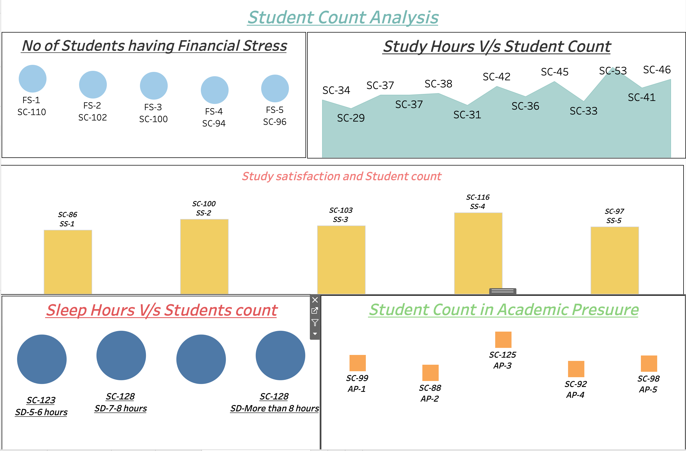
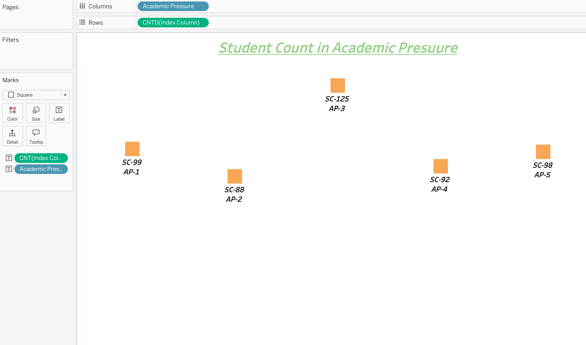
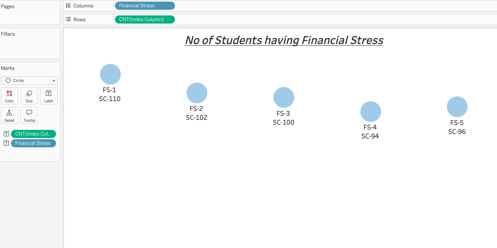
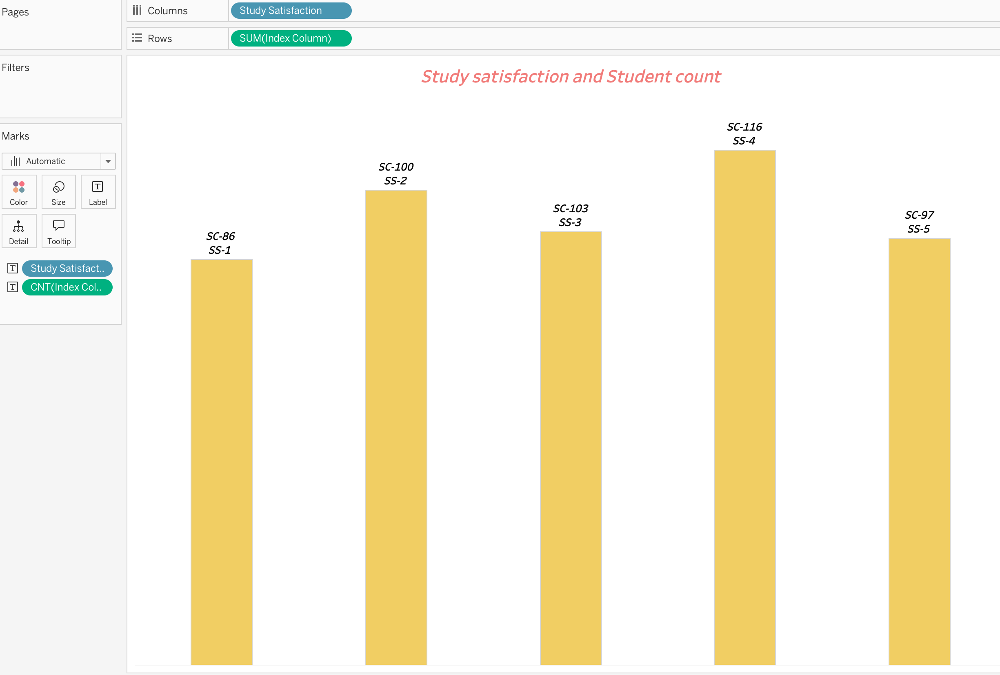
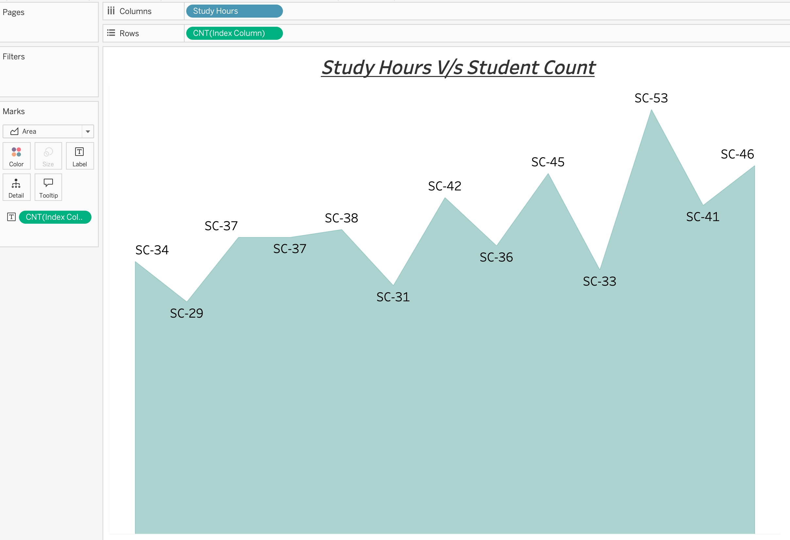
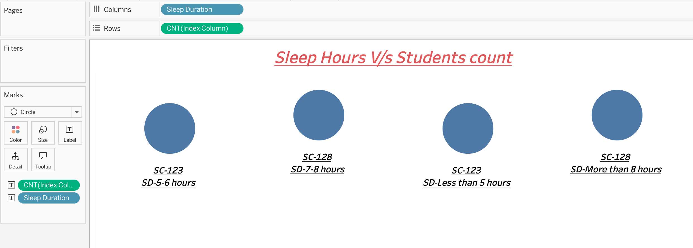

# Student Depression Analysis Using Tableau

## Project Overview

This project explores different academic, lifestyle, and financial factors associated with student mental health using Tableau.

The analysis examines academic pressure, financial stress, study satisfaction, study hours, sleep duration, dietary habits, family history of mental illness, suicidal thoughts, and depression status.

An interactive Tableau dashboard was created to present the distribution of students across these factors in a clear and understandable format.

## Dashboard Preview



## Project Information

| Detail | Information |
|---|---|
| **Tableau Workbook** | `First Project tableau Dashboard.twbx` |
| **Dataset** | `Depression+Student+Dataset.csv` |
| **Dataset Size** | 502 student records |
| **Workbook Type** | Tableau Packaged Workbook (`.twbx`) |
| **Data Storage** | Embedded Tableau Hyper Extract |
| **Visualization Tool** | Tableau |

Because the data extract is embedded inside the packaged Tableau workbook, the project can be opened without separately connecting the CSV file.

## Dataset Features

| Column | Description |
|---|---|
| `Gender` | Gender of the student |
| `Age` | Age of the student |
| `Age_Group` | Age-group category of the student |
| `Academic_Pressure` | Reported level of academic pressure |
| `Study_Satisfaction` | Student's satisfaction with their studies |
| `Study_Hours` | Number of hours spent studying |
| `Sleep_Duration` | Average sleep-duration category |
| `Dietary_Habits` | Quality of the student's dietary habits |
| `Financial_Stress` | Reported level of financial stress |
| `Family_History_of_Mental_Illness` | Whether the student has a family history of mental illness |
| `Have_you_ever_had_suicidal_thoughts` | Reported history of suicidal thoughts |
| `Depression` | Depression status of the student |
| `index_column` | Unique index assigned to each student record |

## Project Objectives

The main objectives of this project are:

- Analyze the distribution of students across different academic-pressure levels.
- Examine the financial-stress levels reported by students.
- Compare students across different study-satisfaction levels.
- Understand the sleep-duration patterns of students.
- Analyze the distribution of students according to study hours.
- Explore factors that may be associated with student depression.
- Present multiple student-related factors through an interactive Tableau dashboard.
- Make the dataset easier to understand using visual analysis.

## Dashboard Visualizations

### 1. Academic Pressure Analysis

This visualization displays the number of students across five academic-pressure levels.

Academic-pressure level 3 contains the highest number of students, with **125 students**.



### 2. Financial Stress Analysis

This visualization presents the distribution of students across five financial-stress levels.

Financial-stress level 1 contains the highest number of students, with **110 students**.



### 3. Study Satisfaction Analysis

This bar chart compares the number of students across five study-satisfaction levels.

Study-satisfaction level 4 contains the highest number of students, with **116 students**.



### 4. Sleep Duration Analysis

This visualization groups students according to their reported sleep duration.

The **7–8 hours** and **more than 8 hours** categories have the highest counts, with **128 students each**.



### 5. Study Hours Analysis

This area chart displays the distribution of students according to their study-hour values.

The highest observed study-hours category contains **53 students**, while the lowest observed category contains **29 students**.



### 6. Combined Student Count Dashboard

The final dashboard combines the following five visualizations into one analytical view:

- Financial stress
- Study hours
- Study satisfaction
- Sleep duration
- Academic pressure

This combined dashboard makes it easier to compare the distribution of students across multiple academic and lifestyle factors.


## Key Findings

- The dataset contains **502 student records**.
- Academic-pressure level 3 has the highest count, with **125 students**.
- Academic-pressure level 2 has the lowest count, with **88 students**.
- Financial-stress level 1 has the highest count, with **110 students**.
- Financial-stress level 4 has the lowest count, with **94 students**.
- Study-satisfaction level 4 has the highest count, with **116 students**.
- Study-satisfaction level 1 has the lowest count, with **86 students**.
- The 7–8 hours and more-than-8-hours sleep categories contain **128 students each**.
- The 5–6 hours and less-than-5-hours categories contain **123 students each**.
- The highest student count in the study-hours analysis is **53 students**.
- The dashboard provides a consolidated overview of academic, financial, and lifestyle-related student characteristics.

> These findings describe patterns and distributions within the dataset. They do not prove that any particular factor causes depression.

## Key Analysis Areas

- Student distribution by academic pressure
- Student distribution by financial stress
- Student distribution by study satisfaction
- Student distribution by study hours
- Student distribution by sleep duration
- Depression patterns by gender
- Depression patterns by age group
- Dietary habits and depression
- Family history of mental illness
- History of suicidal thoughts

## Tools and Technologies

- **Tableau**
- **Tableau Hyper Extract**
- **CSV**
- **Data Visualization**
- **Exploratory Data Analysis**
- **Dashboard Design**
- **Data Interpretation**

## How to Run the Project

### 1. Clone the repository

```bash
git clone https://github.com/ankurkumar548/Student-depression-data.git
```

### 2. Open the project folder

```bash
cd Student-depression-data
```

### 3. Install Tableau

Download and install either:

- [Tableau Public](https://public.tableau.com/)
- Tableau Desktop

### 4. Open the packaged workbook

Open the following file in Tableau:

```text
First Project tableau Dashboard.twbx
```

### 5. Explore the dashboard

Open the dashboard and interact with the available worksheets and visualizations.

## Repository Structure

```text
Student-depression-data/
├── Depression+Student+Dataset.csv
├── First Project tableau Dashboard.twbx
├── academic-pressure-analysis.png
├── financial-stress-analysis.png
├── sleep-duration-analysis.png
├── student-count-dashboard.png
├── study-hours-analysis.png
├── study-satisfaction-analysis.png
└── README.md
```

## Future Improvements

- Add KPI cards for total students, depressed students, and depression rate.
- Add filters for gender, age group, and depression status.
- Compare depression status directly with academic pressure.
- Compare depression status directly with financial stress.
- Analyze depression according to sleep duration and dietary habits.
- Add percentage-based comparisons instead of only student counts.
- Replace abbreviated labels such as `SC`, `AP`, `FS`, `SS`, and `SD` with complete descriptive labels.
- Improve the dashboard colour palette and formatting.
- Add interactive tooltips for each visualization.
- Publish the completed dashboard on Tableau Public.
- Add a live Tableau Public dashboard link to the repository.

## Disclaimer

This project was created for educational and exploratory purposes only.

The observations presented in this project should not be used for medical diagnosis, treatment, or professional mental-health advice. Relationships observed in the dataset do not necessarily indicate causation.

## Author

**Ankur Kumar**

B.Tech in Electrical Engineering  
National Institute of Technology Agartala
